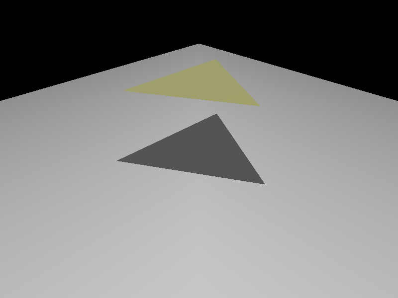
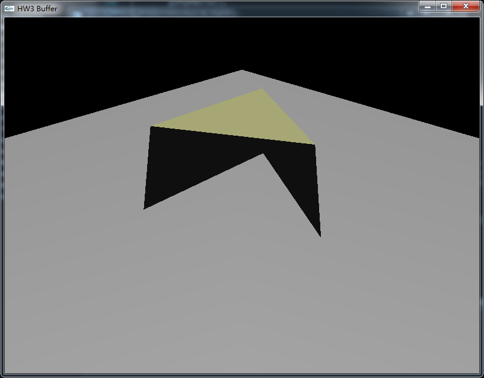
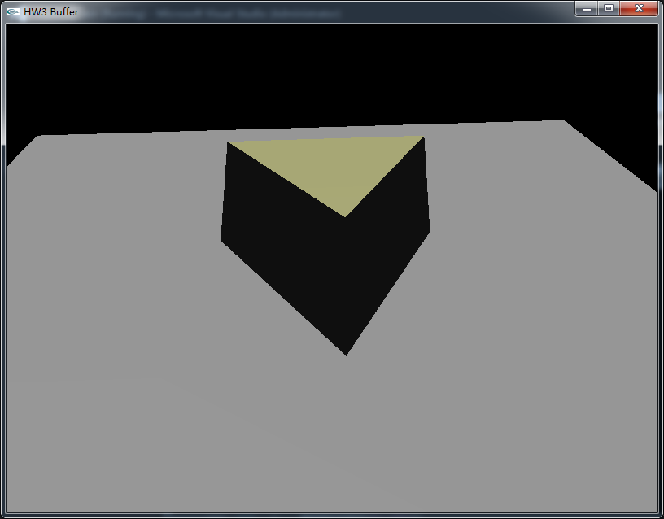
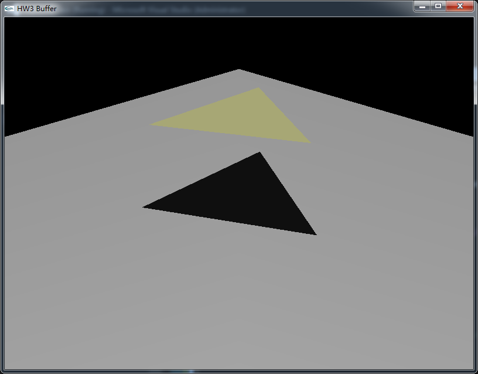

# 开发日志

使用 openGL stencil test 产生阴影效果。

最终结果如下所示：



## bug 及其解决

* shadow polygon 产生问题

出现如下图所示的 bug :



原因是在进行 stencil test 时，`glStencilOp` 调用顺序不对，下面是错误的方式：

```c
// 锁定 color buffer and depth buffer
glColorMask(GL_FALSE, GL_FALSE, GL_FALSE, GL_FALSE);
glDepthMask(GL_FALSE);
glEnable(GL_CULL_FACE);	
// pass 2. front face stencil update
glCullFace(GL_BACK);						// 切掉 back face
shadowPolygon();
glStencilOp(GL_KEEP, GL_KEEP, GL_INCR);		// 通过z-buff 测试，stencil 值+1
// pass 3. back face stencil update
glCullFace(GL_FRONT);						// 切掉 front face	
shadowPolygon();
glStencilOp(GL_KEEP, GL_KEEP, GL_DECR);		// 通过z-buff 测试，stencil 值-1
// 恢复
glColorMask(GL_TRUE, GL_TRUE, GL_TRUE, GL_TRUE);
glDepthMask(GL_TRUE); 
glStencilMask(~0);							// 锁定 stencile 
glDisable(GL_CULL_FACE);
// pass 4. 
glStencilFunc(GL_EQUAL, 0, ~0);
glDepthFunc(GL_EQUAL); glBlendFunc(GL_ONE, GL_ONE);
light();
drawScene();
```

如果在画出 shadow polygon 之前就调用 `glStenciOp` 那么就无法，将 `glStenciOp` 作用到 shadow polygon 上。


* 按下键盘，触发移动视点事件时，出现下面的 bug 



此时需要在上面代码的后面加上如下两句：

```c
glDisable(GL_STENCIL_TEST);
glStencilFunc(GL_ALWAYS, 0, ~0);
```

* 阴影颜色太深问题 



主要是直接把lighting disable

正确做法是只把diffuse與specular光源亮度设为 0 0 0

所以需要添加一个 `ambient_lignt()` 函数：

```
void ambient_light()
{
	glShadeModel(GL_SMOOTH);
	// z buffer enable
	glEnable(GL_DEPTH_TEST);
	// enable lighting
	glEnable(GL_LIGHTING);
	float diffuse[3] = {0, 0, 0};
	float specular[3] = {0, 0, 0};

	for (size_t i = 0; i < globalight->lTotal; i++) {
		// set light property
		glEnable(GL_LIGHT0 + i);
		glLightfv(GL_LIGHT0 + i, GL_POSITION, globalight->lightList[i].light_position);
		glLightfv(GL_LIGHT0 + i, GL_DIFFUSE, diffuse);
		glLightfv(GL_LIGHT0 + i, GL_SPECULAR, specular);
		glLightfv(GL_LIGHT0 + i, GL_AMBIENT, globalight->lightList[i].light_ambient);
	}
	//glutSolidCube(1);
}
```
 