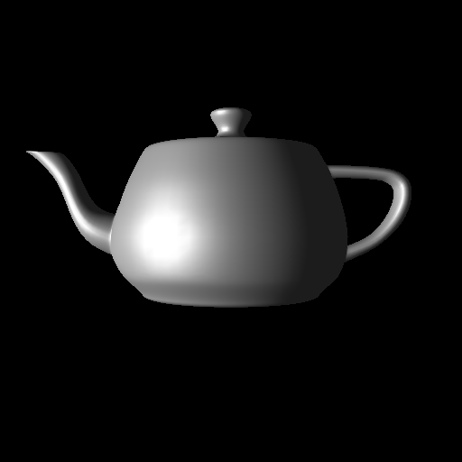
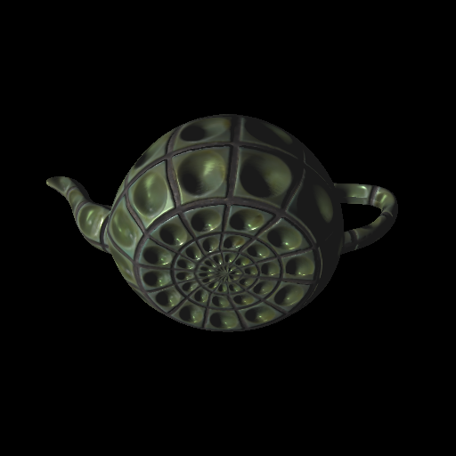
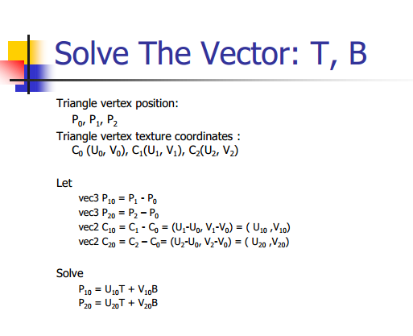
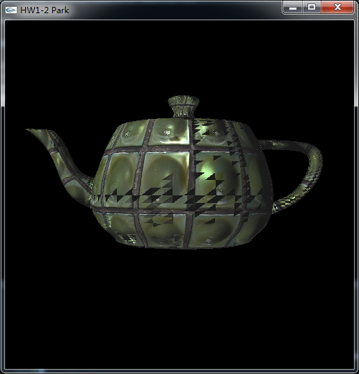

# 开发日志

目标是：使用 shader programming 对物体应用 normal map, diffuse map 和 specular map 技术

并实现键盘控制相机与光源

效果如下图所示：

* 贴图前


* 贴图后


## 原理与框架


### cpu 部分

需要算出每个 face 的切向量 `tangent` `bitangent`，然后定义成 arrtibute 变量“传入”到 `vertex shader` 中。

注意，这里传入的具体细节如下：

```c
// 先确定顶点属性的 location，算完切向量后，再设置属性值
tangent_loc = glGetAttribLocation(MyShader, "tangent");
bitangent_loc = glGetAttribLocation(MyShader, "bitangent");

// 这里计算切向量，副切向量
// glm::vec3 tangent, bitangent;
// ...

// 最后 specify the value of a generic vertex attribute 设置顶点属性
glVertexAttrib3f(tangent_loc, tangent.x, tangent.y, tangent.z);
glVertexAttrib3f(bitangent_loc, bitangent.x, bitangent.y, bitangent.z);
```

而计算切向量和副切向量的方法是：



实际上是解一个二元方程组，代码实现如下：

```c
float *vertex0 = object->vList[object->faceList[i][0].v].ptr;
float *vertex1 = object->vList[object->faceList[i][1].v].ptr;
float *vertex2 = object->vList[object->faceList[i][2].v].ptr;
glm::vec3 p0(vertex0[0], vertex0[1], vertex0[2]);
glm::vec3 p1(vertex1[0], vertex1[1], vertex1[2]);
glm::vec3 p2(vertex2[0], vertex2[1], vertex2[2]);
// 取得贴图三点 对应贴图坐标
float *texture0 = object->tList[object->faceList[i][0].t].ptr;
float *texture1 = object->tList[object->faceList[i][1].t].ptr;
float *texture2 = object->tList[object->faceList[i][2].t].ptr;
glm::vec2 UV0(texture0[0], texture0[1]);
glm::vec2 UV1(texture1[0], texture1[1]);
glm::vec2 UV2(texture2[0], texture2[1]);
// 得到两边
glm::vec3 Edge1 = p1 - p0;
glm::vec3 Edge2 = p2 - p0;
glm::vec2 Edge1uv = UV1 - UV0;
glm::vec2 Edge2uv = UV2 - UV0;
// 计算切向量，副切向量
glm::vec3 tangent, bitangent;
float cp = Edge1uv.x * Edge2uv.y - Edge2uv.x * Edge1uv.y;
if(cp != 0.0f) {
	float mul = 1.0f /cp;
	tangent = (Edge1 * Edge2uv.y + Edge2 * -Edge1uv.y) * mul;
	bitangent = (Edge1 * -Edge2uv.x + Edge2 * Edge1uv.x) * mul;
}
```

贴图部分则，直接将所需的三张贴图绑定到multi-texture的GL_TEXTURE0 ~ 2 即可。

```c
glActiveTexture( GL_TEXTURE0 );
glBindTexture(GL_TEXTURE_2D, globalscene->mList[0].ambTextureId);
GLint location0 = glGetUniformLocation(MyShader, "colorTexture");
if(location0 == -1)
	printf("Cant find texture name: colorTexture\n");
else
	glUniform1i(location0, 0);
```

通过获取 location 后设置 location 的值，将贴图传递到 `fragment shader`中。

画出模型的时候，直接使用下面的代码确定贴图坐标映射：

```c
glMultiTexCoord2fv(GL_TEXTURE0, object->tList[object->faceList[i][j].t].ptr);
glMultiTexCoord2fv(GL_TEXTURE1, object->tList[object->faceList[i][j].t].ptr);
glMultiTexCoord2fv(GL_TEXTURE2, object->tList[object->faceList[i][j].t].ptr);
```

### vertex shader 部分

采用 `Phong Shading` 光照模型，复制该模型代码即可，剩下的步骤是将切向量 `tangent` 与 `bitangent` 使用 `varying` 变量传递到 `fragment shader` 中去。

### fragment shader

1. 读取 normal map 之后，将 rgb 从[0,1] 映射到[-1,1] 上。
2. rgb分別乘以切向量TB与法向量N，得到新的法向量
3. 使用 `Phong shading` 模型，计算`lighting` （光照），diffuse 与 specular 的值需要从贴图中读出来，而不是用light的diffuse，specular 乘上材料系数。

注意直接通过 `varying` 获取的 `normal` 变量，也需要进行单位化，使用 `normalize` 函数。


## bug 及其解决

出现破图：



原因是在算 `tangent` 与 `bitangent` 时，edge 的顺序弄反了。

复制代码时出现的失误 :(